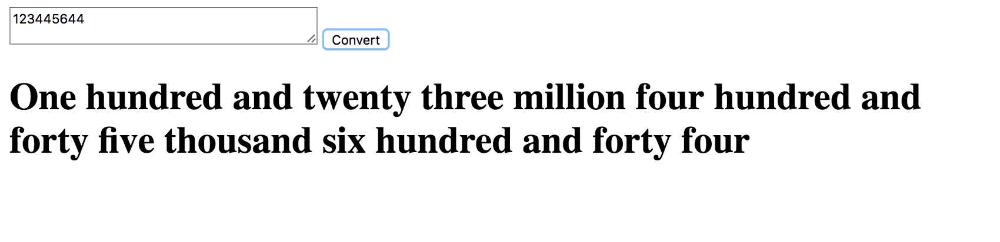

**Number to words converter**

# How to run ?
1. Clone this repo
     - `git clone https://github.com/VathsalaM/number_to-words`
2. CD to that repo
     - `cd number_to-words`
3. Install dependencies
      - `npm install`
4. Start the server
    - `node server.js`
5. Open the app by hitting following url in browser
    - `localhost:8080`
    
**Example**

